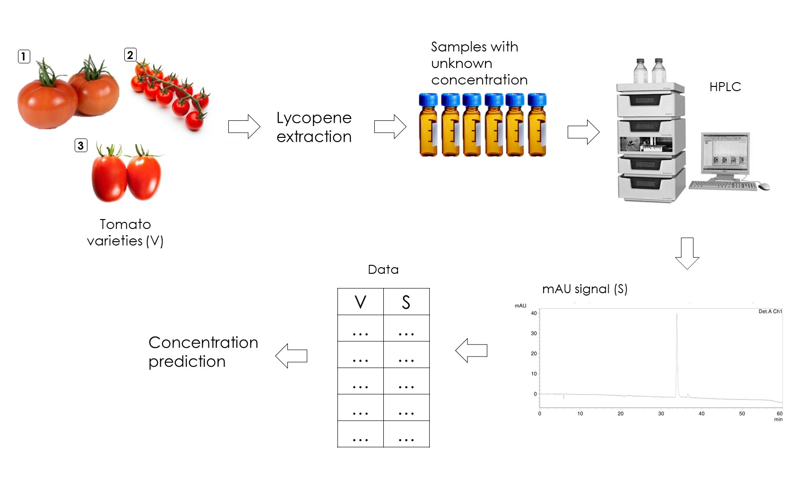
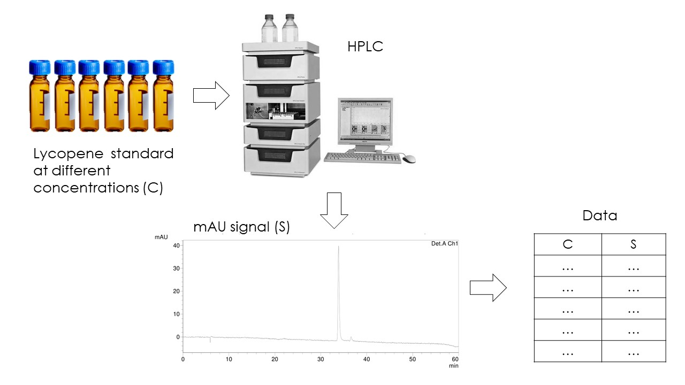
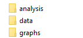

A R tutorial about how to perform a simple linear regression applied to a quantification problem.  

Note that I did not explain how I simulated the experimental data, but you can see the code on data_simulation.R  

If you have cloned this repository and want to run this analysis from scratch first run erase_all_outputs.R script and then run Main.R script o whichever script you want.  

The image and README_files folders contain images that I’ve used on this presentation.  

Juan Pablo Carreón Hidalgo  

jpch_26@outlook.com  

&nbsp;  

## Problem

You need to quantify the lycopene quantity of three tomato varieties. You take samples from these tomatoes and extract the compound of interest. Then you use [HPLC](https://en.wikipedia.org/wiki/High-performance_liquid_chromatography) to quantify the lycopene concentration in the extracts.  



You HPLC equipment just gives to you signals data as milli-absorbance units (mAU). The intensity of this signals is proportional to the concentration in the samples.  

You made four repetitions per variety and your data look like this:   

```{r sample data, echo=FALSE}
sample_data <- read.csv("data/sample_data.csv")
sample_data <- kableExtra::kbl(sample_data)

kableExtra::kable_classic_2(sample_data, full_width = FALSE)
```

How can you estimate the concentration of the tomato extracts?   

Lycopene is a  pigment and its consumption is related with several health benefits, more information in the paper: [Carotenoids: biochemistry, pharmacology and treatment](https://pubmed.ncbi.nlm.nih.gov/27638711/).  

&nbsp;  

## Solution 

You can made a calibration curve to estimate the unknown concentrations. You buy a lycopene standard (the compound in its pure state) and you prepare solutions with a known concentration. Again you use your HPLC equipment to obtain the signals data. 



All analysis are made by triplicate and your first ten measurements may look like this:  

```{r calibration curve data, echo=FALSE}
calibration_data <- read.csv("data/calibration_curve_data.csv")
calibration_data <- kableExtra::kbl(head(calibration_data, 10))

kableExtra::kable_classic_2(calibration_data, full_width = FALSE)
```

Let's estimate the lycopene concentration of the tomato extracts using the data obtained from the standard solutions. This will be done by a simple linear regression analysis.  

First, my files are organized this way:  

  

* The analysis folder contains my R scripts, one script for each individual analysis.  
* The data folder contains my data, my experimental data products and my analysis products when their outputs produce text or CSV files.  
* The graphs folder contains the graphical outputs produced by their correspond R scripts.  

Remember, this organization is just a suggestion. Feel free to try another one that makes you feel more comfortable, but remember, it is important ensure that everyone who sees your organization and code be capable to understand and reproduce your analysis.  

&nbsp;  

### Simple linear regression analysis  

To perform this analysis I used the follow R script:  

```{r linear analysis scripts, code = readLines("analysis/linear_regression.R"), message=FALSE}

```

```{r source linear analysis scripts, echo=FALSE, message=FALSE}
source("analysis/linear_regression.R")
```

First I checked if the necessary packages are already loaded, in this case I've used `ggplot2` to make a nice plot of the linear model. Then I imported the data, both for the calibration curve and the tomato extracts.  

```{r first step, eval=FALSE}
# Packages
if (!"ggplot2" %in% .packages()) library(ggplot2)

# 1 Import data ----------------------------------------------------------

# 1.1 Calibration curve data
curve_data <- read.csv("data/calibration_curve_data.csv")

# 1.2 Tomato extracts data
sample_data <- read.csv("data/sample_data.csv")
```

On the second step I fitted the linear model with the code `model_lm <- lm(C ~ S, data = curve_data)`, where I specified a simple relation between the standard concentrations and the signals from the HPLC. I coded this as if C were dependent on S, this way the tomato extracts predictions would be easy to obtain.  

On the next lines of code I've made a nice summary:  

```{r linear summary code, eval=FALSE}
# 2.2 Linear model summary 
model_sum <- summary(model_lm)
```

```{r linear summary}
model_sum
```

An ANOVA table:  

```{r anova table code, eval=FALSE}
# 2.3 ANOVA for linear summary
model_anova <- anova(model_lm)
```

```{r anova table format, echo=FALSE}
options(knitr.kable.NA = '')

model_anova <- kableExtra::kbl(model_anova, digits = 2)
model_anova <- kableExtra::kable_classic_2(model_anova, full_width=FALSE)
```

```{r anova table}
model_anova
```

And a nice a plot:  

```{r model plot code, eval=FALSE}
# 2.4 Point plot for data and the model 
model_plot <- ggplot(curve_data, aes(x = S, y = C)) +
  geom_point() +
  geom_smooth(method = "lm", formula = y ~ x, se = FALSE) +
  xlab("Signal (mAU)") +
  ylab("Concentration (mmol)") +
  theme_classic() +
  theme(
    axis.text.x = element_text(color = "black", size = 13),
    axis.text.y = element_text(color = "black", size = 13),
    axis.title = element_text(color = "black", size = 15)
  )
```

```{r model plot}
model_plot
```

Note that in `geom_smooth` I set `se = FALSE`. By default `se = TRUE`, and this displays a confidence interval around the regression line.  I also specified the model `y ~ x` just as I did with `lm()` function`.  

On the third step I saved all the analysis results, including the plot, in their folders.  

```{r save results code, eval=FALSE}
# 3 Save model results ----------------------------------------------------

capture.output(model_sum, file = "data/model_summary.txt")
write.csv(model_anova, file = "data/model_ANOVA.csv")
ggsave(filename = "graphs/model_plot.jpg", model_plot)
```

Finally, on the fourth step I made the concentration predictions of the tomato extracts.  
```{r predictions code, eval=FALSE}
# 4 Sample concentration predictions ----------------------------------------

# 4.1 Predictions data frame 
sample_pred <- predict.lm(model_lm, newdata = sample_data)
sample_pred <- data.frame(C = round(sample_pred, 2))

# 4.2 Join both signals and predictions data frames
sample_pred <- cbind(sample_data, sample_pred)

# 4.3 Sample red points on model_plot
sample_plot <- model_plot +
  geom_point(data = sample_pred, aes(x = S, y = C), color = "red") 
```

I used the function `predict.lm()`. You need to specified the model object (`model_lm`) that the function will use to made the predictions, and the data with the signals from the tomato extracts (`sample_data`).  

`predict.lm()` returns a numeric vector with the predictions, so I converted it into a data frame and joined it with the sample signals data frame. You can see the results table just by typing `sample_pred`:  

```{r results table format, echo=FALSE}
sample_pred <- kableExtra::kbl(sample_pred)
sample_pred <- kableExtra::kable_classic_2(sample_pred, full_width = FALSE)
```
```{r results table}
sample_pred
```
Or by looking in the data folder, I saved this data with the code `write.csv(sample_pred, file = "data/sample_results.csv")`.  

I also display as red dots the predictions data:    

```{r predictions plot}
sample_plot
```

And I saved it with the code `ggsave(filename = "graphs/sample_plot.jpg", sample_plot)`.

Having concentrations data, you should do some calculus and express your quantities as lycopene units/tomato weight per sample. For this you will need the total extract volume and the weight of each tomato sample.  

In later steps, it's usual to make a summary that presents the average quantities and the standard deviations per variety. If you want to compare and establish significant differences between varieties it's also necessary to perform an analysis of variance. I'll cover this topic in another tutorial.

You are free to clone the repository with the code and results of this R tutorial:  

[Simple Linear Regression Applied to Quantification Repository](https://github.com/jpch26/Simple-Linear-Regression-Applied-to-Quantification.git)

Try to reproduce the analysis step by step, modify and improve the code. It's all yours!